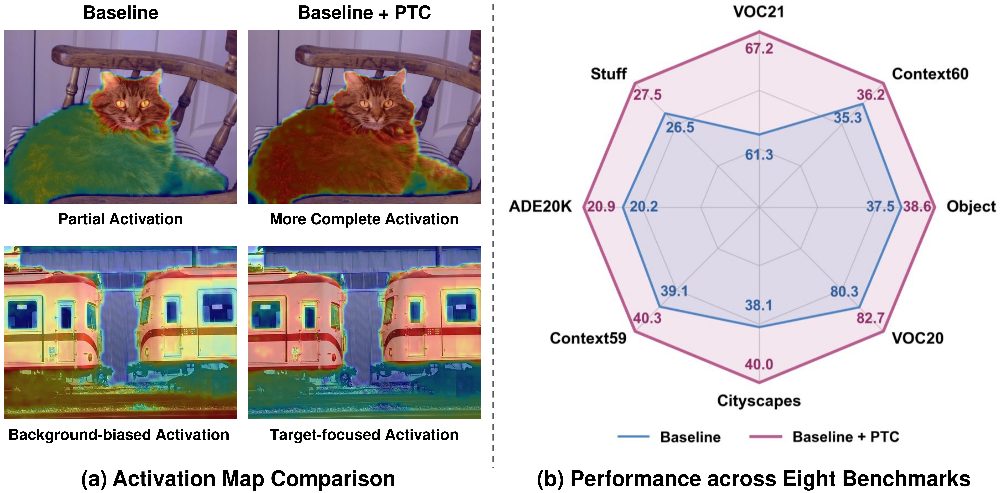

<div align="center">

<h1>Perceptual Anchoring: Prototype-Guided Text Calibration for Training-free Open-Vocabulary Semantic Segmentation</h1>

<div>
    <a href="" target="_blank">Wanli Ma</a>&emsp;
    <!--
    <a href="" target="_blank">Jiangwen Lu</a>&emsp;
    <a href="" target="_blank">Qinmu Peng</a>&emsp;
    <a href="" target="_blank">Xinge You</a>
    -->
</div>

<div>
</div>

<div>
    <h4 align="center">
        • <a href="https://arxiv.org/abs/2608.03991" target="_blank">[arXiv]</a> •
    </h4>
</div>



</div>
<!--
## Abstract
The abstract will be added here.
-->

## Implementation Details

### Configuration Scope

PTC configurations (`ptc_min_seeds` and `ptc_mu`) for ProxyCLIP with CLIP ViT-B/16 and DINO-B/8 are provided in `configs/` and should not be assumed to transfer directly to other backbones or baselines.
Configurations for the additional backbone variants and baseline methods evaluated in the paper will be released upon acceptance.

<!--
### Sliding-window Prototype Construction
For sliding-window inference, PTC aggregates crop-level prototypes across overlapping crops; when the number of crops or the vocabulary size is large, an image-level prototype requires supporting evidence from at least two crops.
-->

### Dependencies and Installation

```bash
# Clone this repository
git clone https://github.com/Valeria-MaW/PTC.git
cd PTC

# Create a new conda environment
conda create -n PTC python=3.10
conda activate PTC

# Install PyTorch and dependencies
pip install -r requirements.txt
```

## Datasets

We include the following dataset configurations in this repo:

1. `With background class`: PASCAL VOC21 (VOC21), PASCAL Context60 (Context60), COCO-Object (Object).
2. `Without background class`: PASCAL VOC20 (VOC20), Cityscapes (City), PASCAL Context59 (Context59), ADE20k-150 (ADE), COCO-Stuff (Stuff).

For datasets, please follow the [MMSeg data preparation document](https://github.com/open-mmlab/mmsegmentation/blob/main/docs/en/user_guides/2_dataset_prepare.md) to download and preprocess the datasets.

The COCO-Object dataset can be converted from COCO-Stuff164k by executing the following command:

```bash
python datasets/cvt_coco_object.py PATH_TO_COCO_STUFF164K -o PATH_TO_COCO164K
```

## Quick Inference

```bash
python demo.py
```

## Model Evaluation

Please modify the settings in `configs/base_config.py` before running the evaluation.

For SAM, please download the checkpoints from [SAM](https://github.com/facebookresearch/segment-anything#model-checkpoints).

Single-GPU:

```bash
python eval.py --config ./configs/cfg_DATASET.py --work-dir YOUR_WORK_DIR
```

Multi-GPU:

```bash
bash ./dist_test.sh ./configs/cfg_DATASET.py
```

Evaluation on all datasets:

```bash
GPUS=GPU_NUM python eval_all.py
```

Results will be saved in `results.xlsx`.

## Citation

```bibtex
```

## Acknowledgement

This implementation is based on [ProxyCLIP](https://github.com/mc-lan/ProxyCLIP). Thanks for the awesome work.

## Contact

If you have any questions, please feel free to reach out at `mawanli09ma@gmail.com`.
